# Advanced display options

This page lists the graphics output types (`set gxout`) and the commands that
control their appearance. Select a command for its detailed reference page.

## Visual gallery

Click an image to open the detailed example page.

| | | | |
| --- | --- | --- | --- |
| [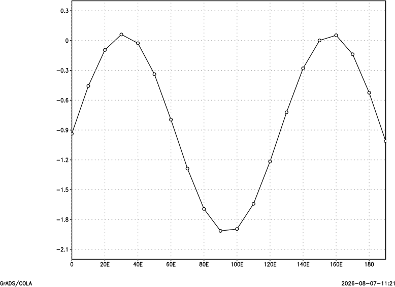](plot-line.md)<br>[Line](plot-line.md) | [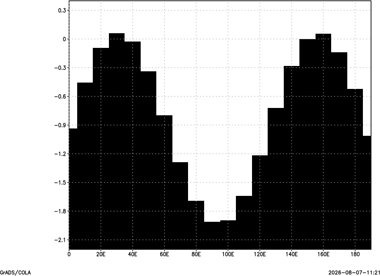](plot-bar.md)<br>[Bar](plot-bar.md) | [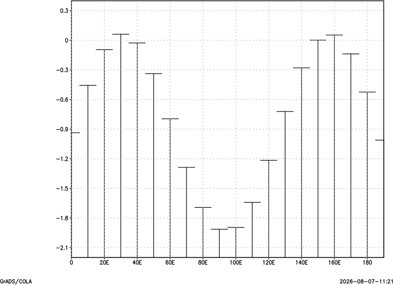](plot-errbar.md)<br>[Error bars](plot-errbar.md) | [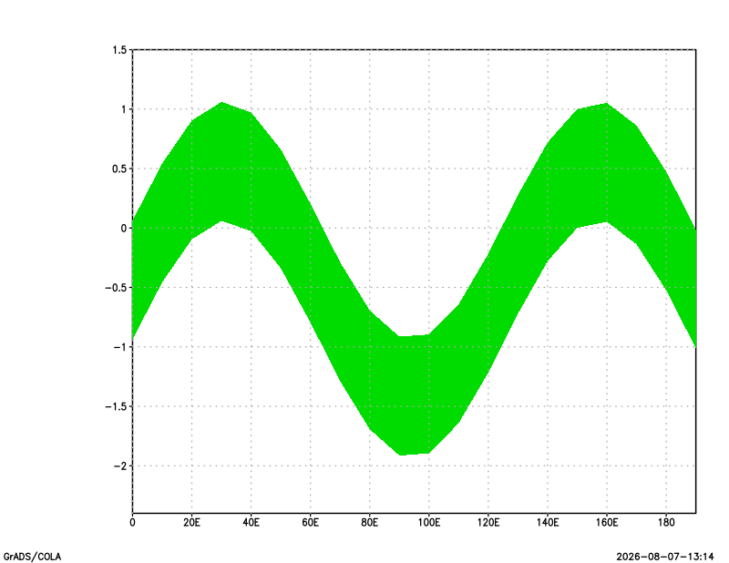](plot-linefill.md)<br>[Line fill](plot-linefill.md) |
| [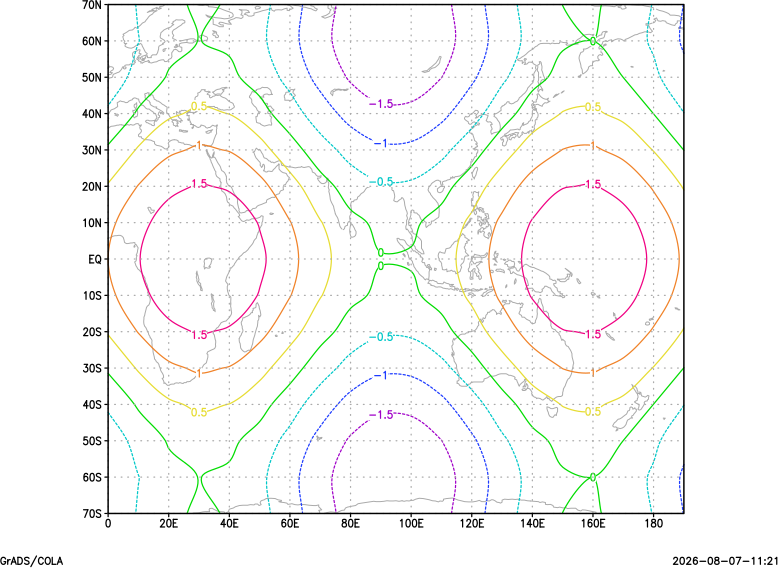](plot-contour.md)<br>[Contour](plot-contour.md) | [](plot-shaded.md)<br>[Shaded](plot-shaded.md) | [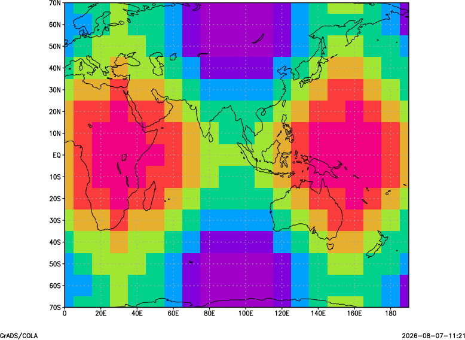](plot-grfill.md)<br>[Grid fill](plot-grfill.md) | [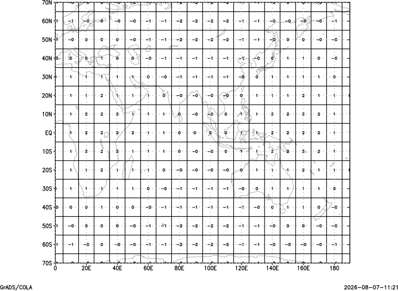](plot-grid.md)<br>[Grid](plot-grid.md) |
| [](plot-vector.md)<br>[Vector](plot-vector.md) | [](plot-barb.md)<br>[Barb](plot-barb.md) | [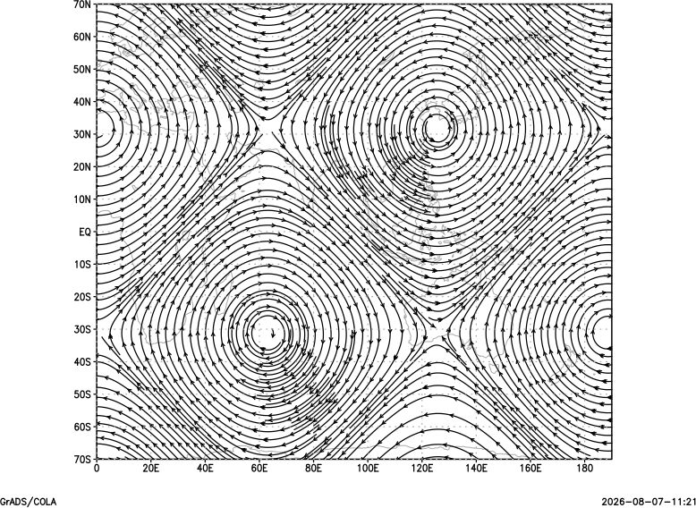](plot-stream.md)<br>[Stream](plot-stream.md) | [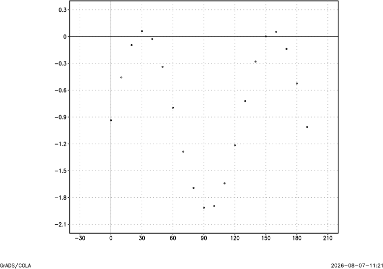](scatterplot.md)<br>[Scatter](scatterplot.md) |
| [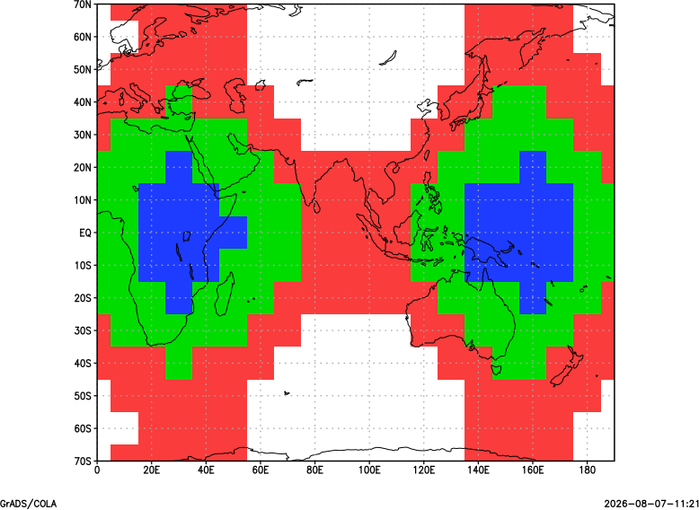](plot-fgrid.md)<br>[Fgrid](plot-fgrid.md) | [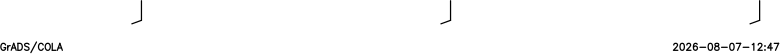](plot-tserbarb.md)<br>[Time-series barb](plot-tserbarb.md) | [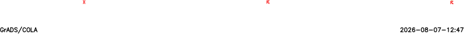](plot-tserwx.md)<br>[Time-series weather](plot-tserwx.md) | [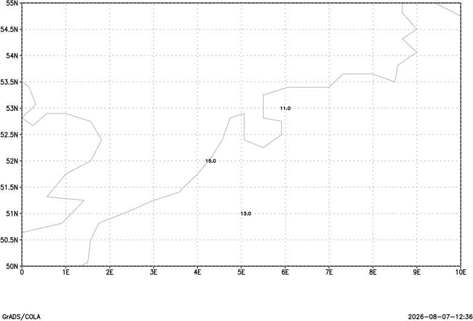](plot-value.md)<br>[Values](plot-value.md) |
| [](plot-wxsym.md)<br>[Weather symbols](plot-wxsym.md) | [](plot-model.md)<br>[Station model](plot-model.md) | | |

| Output mode | Example |
| --- | --- |
| `line`, `bar`, `errbar`, `linefill` | [One-dimensional plots](plot-line.md) |
| `contour`, `shaded`, `grfill`, `grid` | [Two-dimensional scalar plots](plot-contour.md) |
| `vector`, `barb`, `stream` | [Vector and wind plots](plot-vector.md) |
| `scatter` | [Scatter plots](scatterplot.md) |
| `fgrid` | [Specific-value grid fill](plot-fgrid.md) |
| `tserbarb`, `tserwx` | [Station time-series plots](plot-tserbarb.md) |
| `value`, `wxsym`, `model` | [Station plots](plot-value.md) |

## One-dimensional gridded graphics

(1dgraphics)=
### Line graphs (`gxout = line`)

| Option | Description |
| --- | --- |
| [`set ccolor`](gradcomdsetccolor.md) | Line colour |
| [`set cthick`](gradcomdsetcthick.md) | Line thickness |
| [`set cstyle`](gradcomdsetcstyle.md) | Line style |
| [`set cmark`](gradcomdsetcmark.md) | Marker style |
| [`set missconn`](gradcomdsetmissconn.md) | Connect across missing values |

### Bar graphs (`gxout = bar`)

| Option | Description |
| --- | --- |
| [`set bargap`](gradcomdsetbargap.md) | Gap between bars |
| [`set barbase`](gradcomdsetbarbase.md) | Bar baseline |
| [`set baropts`](gradcomdsetbaropts.md) | Bar options |
| [`set cthick`](gradcomdsetcthick.md) | Outline thickness |

### Error bars (`gxout = errbar`)

| Option | Description |
| --- | --- |
| [`set ccolor`](gradcomdsetccolor.md) | Colour |
| [`set cthick`](gradcomdsetcthick.md) | Thickness |
| [`set bargap`](gradcomdsetbargap.md) | Gap between bars |
| [`set barbase`](gradcomdsetbarbase.md) | Baseline |

### Line-graph shading (`gxout = linefill`)

- [`set lfcols`](gradcomdsetlfcols.md) — colours used to fill between lines.

## Two-dimensional gridded graphics

(2dgraphics)=
### Contour plots (`gxout = contour`)

| Option | Option | Option |
| --- | --- | --- |
| [`set ccolor`](gradcomdsetccolor.md) | [`set cthick`](gradcomdsetcthick.md) | [`set cstyle`](gradcomdsetcstyle.md) |
| [`set cterp`](gradcomdsetcterp.md) | [`set cint`](gradcomdsetcint.md) | [`set cmin`](gradcomdsetcmin.md) |
| [`set cmax`](gradcomdsetcmax.md) | [`set black`](gradcomdsetblack.md) | [`set clevs`](gradcomdsetclevs.md) |
| [`set ccols`](gradcomdsetccols.md) | [`set rbrange`](gradcomdsetrbrange.md) | [`set rbcols`](gradcomdsetrbcols.md) |
| [`set clopts`](gradcomdsetclopts.md) | [`set csmooth`](gradcomdsetcsmooth.md) | [`set clab`](gradcomdsetclab.md) |
| [`set clskip`](gradcomdsetclskip.md) |  |  |

### Shaded and grid-fill contours (`gxout = shaded` or `grfill`)

| Option | Option | Option |
| --- | --- | --- |
| [`set cint`](gradcomdsetcint.md) | [`set cmin`](gradcomdsetcmin.md) | [`set cmax`](gradcomdsetcmax.md) |
| [`set black`](gradcomdsetblack.md) | [`set clevs`](gradcomdsetclevs.md) | [`set ccols`](gradcomdsetccols.md) |
| [`set rbrange`](gradcomdsetrbrange.md) | [`set rbcols`](gradcomdsetrbcols.md) | [`set csmooth`](gradcomdsetcsmooth.md) |

### Grid-value plots (`gxout = grid`)

- [`set dignum`](gradcomdsetdignum.md) — number of digits.
- [`set digsize`](gradcomdsetdigsize.md) — digit size.

### Vector plots (`gxout = vector`)

| Option | Option | Option |
| --- | --- | --- |
| [`set ccolor`](gradcomdsetccolor.md) | [`set cthick`](gradcomdsetcthick.md) | [`set arrscl`](gradcomdsetarrscl.md) |
| [`set arrowhead`](gradcomdsetarrowhead.md) | [`set cint`](gradcomdsetcint.md) | [`set cmin`](gradcomdsetcmin.md) |
| [`set cmax`](gradcomdsetcmax.md) | [`set black`](gradcomdsetblack.md) | [`set clevs`](gradcomdsetclevs.md) |
| [`set ccols`](gradcomdsetccols.md) | [`set rbrange`](gradcomdsetrbrange.md) | [`set rbcols`](gradcomdsetrbcols.md) |
| [`set arrlab`](gradcomdsetarrlab.md) |  |  |

### Wind-barb plots (`gxout = barb`)

Wind-barb plots use the vector and annotation settings listed in the relevant
[`set` command reference](commandsatt.md).

### Scatter plots (`gxout = scatter`)

- [`set cmark`](gradcomdsetcmark.md)
- [`set digsize`](gradcomdsetdigsize.md)
- [`set ccolor`](gradcomdsetccolor.md)

### Specific-value grid fill (`gxout = fgrid`)

- [`set fgvals`](gradcomdsetfgvals.md)

### Streamline plots (`gxout = stream`)

Streamlines support colour, contour, and density controls:

[`set ccolor`](gradcomdsetccolor.md), [`set cint`](gradcomdsetcint.md),
[`set cmin`](gradcomdsetcmin.md), [`set cmax`](gradcomdsetcmax.md),
[`set cthick`](gradcomdsetcthick.md), [`set black`](gradcomdsetblack.md),
[`set clevs`](gradcomdsetclevs.md), [`set ccols`](gradcomdsetccols.md),
[`set rbrange`](gradcomdsetrbrange.md), [`set rbcols`](gradcomdsetrbcols.md),
and [`set strmden`](gradcomdsetstrmden.md).

## One-dimensional station graphics

(1dstation)=
### Time-series wind barbs (`gxout = tserbarb`)

See [`tserbarb`](gradcomdtserbarb.md).

### Time-series weather symbols (`gxout = tserwx`)

See [`tserwx`](gradcomdtserwx.md).

## Two-dimensional station graphics

(2dstation)=
### Station values (`gxout = value`)

[`set ccolor`](gradcomdsetccolor.md), [`set cthick`](gradcomdsetcthick.md),
[`set digsize`](gradcomdsetdigsize.md), and [`set stid`](gradcomdsetstid.md).

### Station wind barbs (`gxout = barb`)

[`set ccolor`](gradcomdsetccolor.md), [`set cthick`](gradcomdsetcthick.md),
and [`set digsize`](gradcomdsetdigsize.md).

### Station weather symbols (`gxout = wxsym`)

[`set ccolor`](gradcomdsetccolor.md), [`set cthick`](gradcomdsetcthick.md),
[`set digsize`](gradcomdsetdigsize.md), and [`set wxcols`](gradcomdsetwxcols.md).

### Station models (`gxout = model`)

[`set ccolor`](gradcomdsetccolor.md), [`set cthick`](gradcomdsetcthick.md),
[`set digsize`](gradcomdsetdigsize.md), [`set mdlopts`](gradcomdsetmdlopts.md),
and [`set wxcols`](gradcomdsetwxcols.md).

## Other display options

(other)=
### Find the nearest station

Use [`gxout = findstn`](script.md#set-gxout-findstn) to find the station nearest a
specified x/y location.

### Display data information

Use [`gxout = stat`](gradcomdstat.md) to display statistics for an expression.

## Set commands that control graphics display

(setcommands)=
### Plot ranges

[`set vrange`](gradcomdsetvrange.md) and [`set vrange2`](gradcomdsetvrange2.md)
control the range for one-dimensional and scatter plots.

### Log scaling and axis direction

[`set xyrev`](gradcomdsetxyrev.md), [`set xflip`](gradcomdsetxflip.md), and
[`set yflip`](gradcomdsetyflip.md) control axis direction and logarithmic
scaling when the z dimension is plotted.

### Axis labels

[`set xaxis`](gradcomdsetxaxis.md), [`set yaxis`](gradcomdsetyaxis.md),
[`set xlint`](gradcomdsetxlint.md), [`set ylint`](gradcomdsetylint.md),
[`set xlab`](gradcomdsetxlab.md), [`set ylab`](gradcomdsetylab.md),
[`set xlevs`](gradcomdsetxlevs.md), [`set ylevs`](gradcomdsetylevs.md),
[`set xlopts`](gradcomdsetxlopts.md), [`set ylopts`](gradcomdsetylopts.md),
[`set xlpos`](gradcomdsetxlpos.md), and [`set ylpos`](gradcomdsetylpos.md).

### Map projections and map drawing

- Projection: [`set mproj`](gradcomdsetmproj.md), [`set mpvals`](gradcomdsetmpvals.md).
- Map data and boundaries: [`set mpdset`](gradcomdsetmpdset.md), [`set poli`](gradcomdsetpoli.md), [`set map`](gradcomdsetmap.md), [`set mpdraw`](gradcomdsetmpdraw.md), and [`set grid`](gradcomdsetgrid.md).

### Annotation and frame controls

- Annotation: [`set font`](gradcomdsetfont.md), [`draw title`](gradcomddrawtitle.md), and [`set annot`](gradcomdsetannot.md).
- Console display: [`set display`](gradcomdsetdisplay.md).
- Frame advancement: [`set frame`](gradcomdsetframe.md).
- Logo display: [`set grads`](gradcomdsetgrads.md).

```{toctree}
:hidden:
:maxdepth: 1

Line graphs <plot-line>
Bar graphs <plot-bar>
Error bars <plot-errbar>
Line-fill graphs <plot-linefill>
Contour plots <plot-contour>
Shaded contours <plot-shaded>
Grid-fill plots <plot-grfill>
Grid-value plots <plot-grid>
Vector plots <plot-vector>
Wind-barb plots <plot-barb>
Scatter plots <scatterplot>
Specific-value grid fill <plot-fgrid>
Streamlines <plot-stream>
Time-series wind barbs <plot-tserbarb>
Time-series weather symbols <plot-tserwx>
Station values <plot-value>
Station weather symbols <plot-wxsym>
Station models <plot-model>
```
