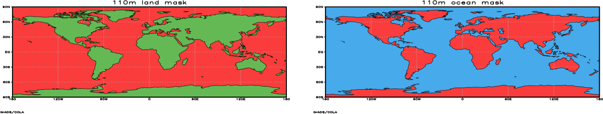
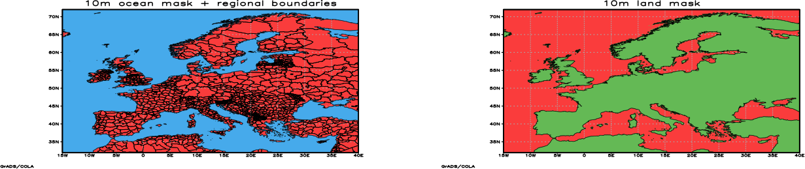

# Basemap Script

GrADS includes `nebasemap.gs`, a script for overlaying a Natural Earth land
or ocean mask on an existing plot. The Natural Earth shapefiles and the
script are installed with GrADS, so the recommended workflow requires no
downloads, path edits, or external ASCII polygon files.

The mask is a display overlay: it does not modify the underlying variable.
Display the variable first, select the matching Natural Earth map data set,
and then run `nebasemap`.

## Recommended workflow

```text
nebasemap L|O [fill_color] [outline_color] [110m|50m|10m]
```

`L` selects the land mask and `O` selects the ocean mask. The defaults are
fill color `15`, outline color `0`, and resolution `110m`. Resolution aliases
`L`, `M`, and `H` are retained for compatibility and mean `110m`, `50m`, and
`10m`, respectively.

The Natural Earth map data set controls coastlines and political boundaries;
the final argument to `nebasemap` controls the resolution of the overlay:

| Map data set | Mask resolution | Typical use |
|---|---|---|
| `ne110m` | `110m` | Global or overview maps |
| `ne50m` | `50m` | Continental maps |
| `ne10m` | `10m` | Regional maps |

For example:

```text
set mpdset ne10m
set lon -15 40
set lat 32 72
set poli on
display temperature
nebasemap O 20 0 10m
```

`set poli on` enables the country and first-order regional boundaries in the
Natural Earth map data. Use `set poli off` when only coastlines are wanted.
The `nebasemap` script redraws the selected map outline after applying the
mask.

Natural Earth polygons retain their ring topology. Islands and interior
holes therefore remain correct, including when a mask is drawn with a
transparent color.

## Examples

The following figures were generated with the installed `nebasemap.gs`
workflow. The source commands use `display field` as a placeholder for the
variable being plotted.

### Global 110m masks

The first panel applies a land mask and the second applies an ocean mask.
Both use the 110m Natural Earth map data set and show only coastlines.



```text
set mpdset ne110m
set lon -180 180
set lat -90 90
set poli off
set rgb 21 100 185 85
display field
nebasemap L 21 1 110m
```

To draw the ocean mask instead, use:

```text
set rgb 20 70 170 235
display field
nebasemap O 20 1 110m
```

### Regional 10m masks and boundaries

The first panel uses a 10m ocean mask with country and regional boundaries.
The second uses a 10m land mask with coastlines only.



Ocean mask with political and regional boundaries:

```text
set mpdset ne10m
set lon -15 40
set lat 32 72
set poli on
set rgb 20 70 170 235
display field
nebasemap O 20 1 10m
```

Land mask with coastlines only:

```text
set poli off
set rgb 21 100 185 85
display field
nebasemap L 21 1 10m
```

### Transparent overlays

The mask is drawn with one shapefile command, so a transparent fill is
uniform across the complete land or ocean geometry:

```text
set rgb 20 70 170 235 -65
set mpdset ne10m
display field
nebasemap O 20 1 10m
```

The negative alpha value tells GrADS to use its color-mask rendering. The
underlying data remain visible through the overlay.

## Legacy workflows

The files and scripts in this section are retained for compatibility with
older GrADS installations. They are secondary documentation and should not
be used for new plots when `nebasemap.gs` is available.

### Legacy `basemap.gs` and ASCII polygons

The historical `basemap.gs` script overlays polygon coordinates from external
ASCII files. It requires manually downloaded files and a path edit in the
script. This workflow is superseded by the packaged Natural Earth masks.

Legacy syntax:

```text
basemap.gs L(and)/O(cean) <fill_color> <outline_color> <L(owres)/M(res)/H(ires)>
```

The legacy ASCII files remain available here only for old scripts:

- [`lpoly_lowres.asc`](_downloads/grads-scripts/lpoly_lowres.asc)
- [`lpoly_mres.asc`](_downloads/grads-scripts/lpoly_mres.asc)
- [`lpoly_hires.asc`](_downloads/grads-scripts/lpoly_hires.asc)
- [`lpoly_US.asc`](_downloads/grads-scripts/lpoly_US.asc)
- [`opoly_lowres.asc`](_downloads/grads-scripts/opoly_lowres.asc)
- [`opoly_mres.asc`](_downloads/grads-scripts/opoly_mres.asc)
- [`opoly_hires.asc`](_downloads/grads-scripts/opoly_hires.asc)

The old low-, medium-, and high-resolution map files and their ASCII masks
have limitations in clipping, regional coverage, and transparent rendering.
Use `ne10m`, `ne50m`, or `ne110m` with `nebasemap.gs` for current work.

### Legacy converted shapefiles

Older documentation also linked shapefiles converted from the ASCII basemap
polygons. They are preserved for existing scripts but are not required by the
installed Natural Earth workflow:

- [`grads_lowres_land.tar.gz`](_downloads/grads-shapefiles/grads_lowres_land.tar.gz)
- [`grads_lowres_ocean.tar.gz`](_downloads/grads-shapefiles/grads_lowres_ocean.tar.gz)
- [`grads_mres_land.tar.gz`](_downloads/grads-shapefiles/grads_mres_land.tar.gz)
- [`grads_mres_ocean.tar.gz`](_downloads/grads-shapefiles/grads_mres_ocean.tar.gz)
- [`grads_hires_land.tar.gz`](_downloads/grads-shapefiles/grads_hires_land.tar.gz)
- [`grads_hires_ocean.tar.gz`](_downloads/grads-shapefiles/grads_hires_ocean.tar.gz)

These archives should not be mixed with the `ne110m`, `ne50m`, and `ne10m`
Natural Earth data sets.
