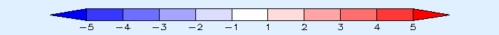

# Controlling Colors in GrADS

This page describes GrADS' built-in color palette, user-defined colors,
transparency, contour palettes, and categorical (`fgrid`) plots.

## Contents

- [Pre-defined default colors](#defaultcolors)
- [The default rainbow palette](#defaultrainbow)
- [Defining new colors](#define)
- [Transparent colors](#transparent)
- [Overriding the default palette](#override)
- [Plotting contours of constant color](#constantcolor)
- [Omitting colors](#omit)
- [Plotting non-continuous index grids](#fgvals)

(defaultcolors)=
## Pre-defined default colors

GrADS provides 16 default colors. Each color has a number used by graphics
commands. The RGB values below are the built-in defaults; color 0 is the
background and color 1 is the foreground, so their effective appearance can
depend on the selected display background.

<style>
.color-swatch { display:inline-block; width:50px; height:12px; border:1px solid #777; vertical-align:middle; }
</style>

| Number | Description | Swatch | Red | Green | Blue |
| ---: | --- | :---: | ---: | ---: | ---: |
| 0 | Background (black by default) | <span class="color-swatch" style="background-color:rgb(0,0,0)"></span> | 0 | 0 | 0 |
| 1 | Foreground (white by default) | <span class="color-swatch" style="background-color:rgb(255,255,255)"></span> | 255 | 255 | 255 |
| 2 | Red | <span class="color-swatch" style="background-color:rgb(250,60,60)"></span> | 250 | 60 | 60 |
| 3 | Green | <span class="color-swatch" style="background-color:rgb(0,220,0)"></span> | 0 | 220 | 0 |
| 4 | Dark blue | <span class="color-swatch" style="background-color:rgb(30,60,255)"></span> | 30 | 60 | 255 |
| 5 | Light blue | <span class="color-swatch" style="background-color:rgb(0,200,200)"></span> | 0 | 200 | 200 |
| 6 | Magenta | <span class="color-swatch" style="background-color:rgb(240,0,130)"></span> | 240 | 0 | 130 |
| 7 | Yellow | <span class="color-swatch" style="background-color:rgb(230,220,50)"></span> | 230 | 220 | 50 |
| 8 | Orange | <span class="color-swatch" style="background-color:rgb(240,130,40)"></span> | 240 | 130 | 40 |
| 9 | Purple | <span class="color-swatch" style="background-color:rgb(160,0,200)"></span> | 160 | 0 | 200 |
| 10 | Yellow-green | <span class="color-swatch" style="background-color:rgb(160,230,50)"></span> | 160 | 230 | 50 |
| 11 | Medium blue | <span class="color-swatch" style="background-color:rgb(0,160,255)"></span> | 0 | 160 | 255 |
| 12 | Dark yellow | <span class="color-swatch" style="background-color:rgb(230,175,45)"></span> | 230 | 175 | 45 |
| 13 | Aqua | <span class="color-swatch" style="background-color:rgb(0,210,140)"></span> | 0 | 210 | 140 |
| 14 | Dark purple | <span class="color-swatch" style="background-color:rgb(130,0,220)"></span> | 130 | 0 | 220 |
| 15 | Gray | <span class="color-swatch" style="background-color:rgb(170,170,170)"></span> | 170 | 170 | 170 |

(defaultrainbow)=
## The default rainbow palette

For continuous contour plots, GrADS uses this sequence of 13 built-in colors
to span the displayed range:

| Color number | Sample |
| ---: | --- |
| 9 | <span class="color-swatch" style="background-color:rgb(160,0,200)"></span> `rgb(160,0,200)` |
| 14 | <span class="color-swatch" style="background-color:rgb(130,0,220)"></span> `rgb(130,0,220)` |
| 4 | <span class="color-swatch" style="background-color:rgb(30,60,255)"></span> `rgb(30,60,255)` |
| 11 | <span class="color-swatch" style="background-color:rgb(0,160,255)"></span> `rgb(0,160,255)` |
| 5 | <span class="color-swatch" style="background-color:rgb(0,200,200)"></span> `rgb(0,200,200)` |
| 13 | <span class="color-swatch" style="background-color:rgb(0,210,140)"></span> `rgb(0,210,140)` |
| 3 | <span class="color-swatch" style="background-color:rgb(0,220,0)"></span> `rgb(0,220,0)` |
| 10 | <span class="color-swatch" style="background-color:rgb(160,230,50)"></span> `rgb(160,230,50)` |
| 7 | <span class="color-swatch" style="background-color:rgb(230,220,50)"></span> `rgb(230,220,50)` |
| 12 | <span class="color-swatch" style="background-color:rgb(230,175,45)"></span> `rgb(230,175,45)` |
| 8 | <span class="color-swatch" style="background-color:rgb(240,130,40)"></span> `rgb(240,130,40)` |
| 2 | <span class="color-swatch" style="background-color:rgb(250,60,60)"></span> `rgb(250,60,60)` |
| 6 | <span class="color-swatch" style="background-color:rgb(240,0,130)"></span> `rgb(240,0,130)` |

For line contours, GrADS chooses a contour interval so successive contours use
different colors across this sequence. The same palette influences the
default intervals for filled contours and shaded grid plots.

The downloadable [`cbar.gs`](_downloads/grads-scripts/cbar.gs) and
[`cbarn.gs`](_downloads/grads-scripts/cbarn.gs) scripts draw a color key next
to filled contours or shaded grid cells. They use [`query shades`](gradcomdquery.md)
to obtain the contour levels and their colors.

(define)=
## Defining new colors

The 16 default colors are not sufficient for every plot. Use
[`set rgb`](gradcomdsetrgb.md) to define colors 16–99 (and, in newer GrADS
versions, up to color 255):

```text
set rgb color# R G B [alpha]
```

The red, green, and blue values range from 0 to 255. For example, the
following commands define blue shades, white, and red shades for an anomaly
palette:

```text
* Blue shades
set rgb 16   0   0 255
set rgb 17  55  55 255
set rgb 18 110 110 255
set rgb 19 165 165 255
set rgb 20 220 220 255

* Red shades
set rgb 21 255 220 220
set rgb 22 255 165 165
set rgb 23 255 110 110
set rgb 24 255  55  55
set rgb 25 255   0   0
```

The new colors can be referenced by number in any command that accepts a
color.

(transparent)=
## Transparent colors

Starting with GrADS 2.1, [`set rgb`](gradcomdsetrgb.md) accepts an optional
alpha value:

```text
set rgb color# R G B alpha
```

The alpha value controls opacity. A negative alpha value enables color
masking: GrADS uses the absolute value for the rendered color and paints it
only where the mask was set.

### How color masking works

Filled contours, shaded grids, Natural Earth land/ocean masks, and filled
shapefiles may consist of many overlapping polygons. Applying a semi-
transparent color separately to every polygon can produce visible seams or
lines where polygon boundaries overlap.

With a masked color, GrADS first draws the affected pixels to a temporary
mask. At the end of a `draw` or `display` command, it paints the color onto
the main image once, using the mask. This avoids repeatedly applying the
alpha value to the same pixels.

Masking is an image operation, so it can produce pixelated boundaries at low
output resolution and may be slower than ordinary drawing. It is generally
unnecessary for `set gxout shade2`, whose shading algorithm handles polygon
boundaries well. It is most useful with the older `shade1` algorithm and with
filled shapefiles.

See the [basemap examples](basemap.md#examples) and
[shapefile examples](shapefiles.md#examples-and-further-reading) for complete
masked-color workflows.

(override)=
## Overriding the default palette

Use [`set clevs`](gradcomdsetclevs.md) and
[`set ccols`](gradcomdsetccols.md) together to specify exact contour levels
and colors:

```text
set clevs lev1 lev2 lev3 ... levN
set ccols col1 col2 col3 ... colN
```

Contour levels and colors are reset by each [`clear`](gradcomdclear.md) or
[`display`](gradcomddisplay.md) command. Put these commands in a script when
the same palette is used repeatedly.

### Filled contours and shaded grids

For filled contours and shaded grid cells, the number of colors must be one
greater than the number of contour levels. The extra colors represent the
regions below the first level and above the last level.

For the anomaly palette defined above:

```text
set gxout shaded
set clevs -5 -4 -3 -2 -1 1 2 3 4 5
set ccols 16 17 18 19 20 1 21 22 23 24 25
```

The zero contour is omitted, but color 1 remains in the palette. Running
[`cbarn.gs`](_downloads/grads-scripts/cbarn.gs) after displaying the plot
creates a key for the selected levels and colors:



With six colors and five levels, the filled regions correspond to the data
ranges as follows:

| Color | Data range |
| --- | --- |
| `col1` | `values <= lev1` |
| `col2` | `lev1 < values <= lev2` |
| `col3` | `lev2 < values <= lev3` |
| `col4` | `lev3 < values <= lev4` |
| `col5` | `lev4 < values <= lev5` |
| `col6` | `values > lev5` |

### Line contours

For line contours, specify the same number of values in `set clevs` and
`set ccols`: one color for each contour level.

(constantcolor)=
## Plotting contours of constant color

To draw line contours without the rainbow palette, set a single contour color
before each display:

```text
set gxout contour
set ccolor 2
display slp
set ccolor 4
display z(lev=500)
```

This example draws sea-level pressure in red (color 2) and 500 mb
geopotential height in dark blue (color 4).

(omit)=
## Omitting colors

For filled contours and shaded grid cells, assign the background color to
levels that should not be drawn. For example:

```text
set gxout shaded
set clevs -5 -4 -3 -2 -1 1 2 3 4 5
set ccols 0 17 18 19 20 0 21 22 23 24 0
```

Here color 0 omits the regions below -5, between -1 and 1, and above 5.
Depending on the display background, the omitted regions appear black or
white.

With GrADS 2.0 and later, `shade2` and `shade2b` treat negative color numbers
as transparent rather than converting them to color 0. In GrADS 2.1 and
later, `shaded` is an alias for `shade2`.

(fgvals)=
## Plotting non-continuous index grids

For categorical or non-continuous grids, use the `fgrid` graphics output type
with [`set fgvals`](gradcomdsetfgvals.md):

```text
set gxout fgrid
set fgvals 1 15 2 5 3 1
display sfctype
```

In this example, `sfctype` contains three category values:

| Grid value | Meaning | Fill color |
| ---: | --- | ---: |
| 1 | Land | 15 (gray) |
| 2 | Ocean | 5 (light blue) |
| 3 | Sea ice | 1 (white) |

If the first pair of arguments to `set fgvals` is omitted, land cells are not
omitted; only the ocean and sea-ice categories are colored.
