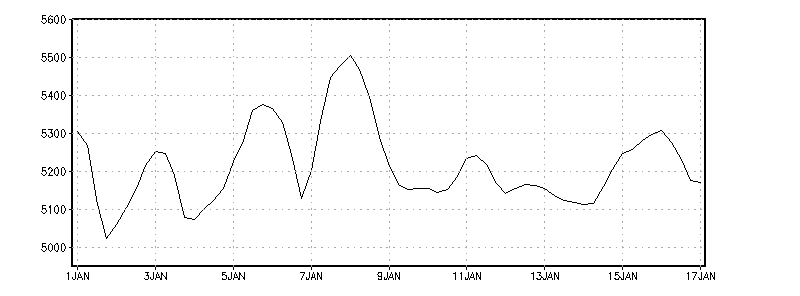
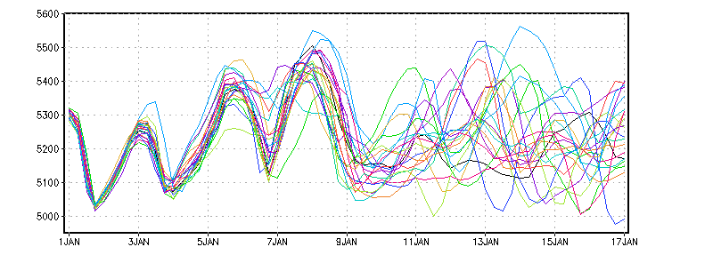
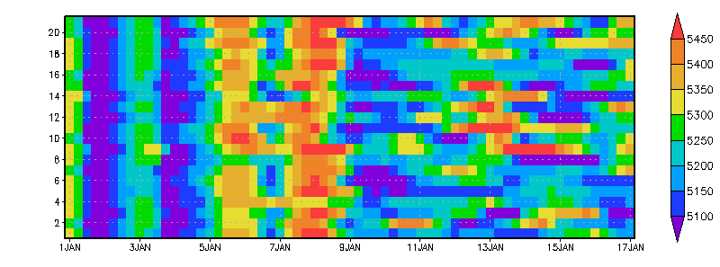
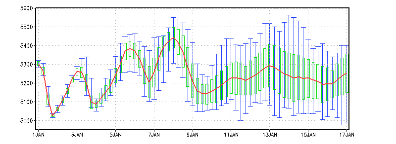
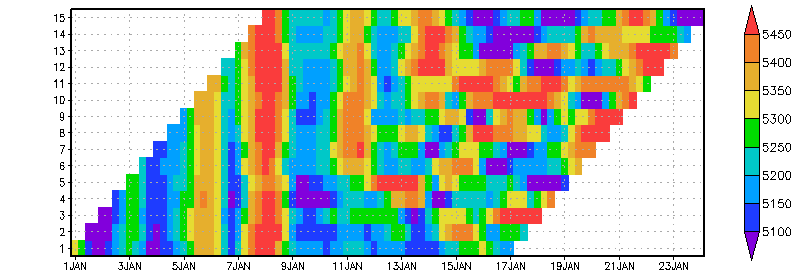
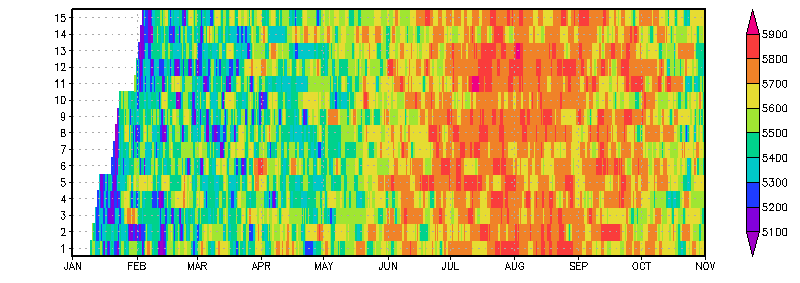
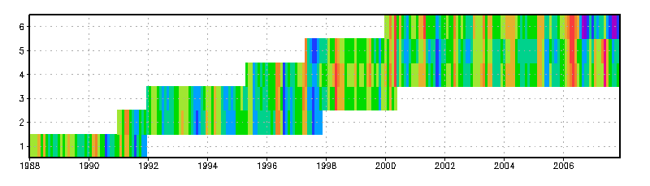

# The Ensemble Dimension

GrADS 2.0 adds a fifth grid dimension, **E** (also called <code>ens</code>),
designed especially for ensemble forecasts. Ensemble members are treated as one
five-dimensional data set rather than as separate files.

## Ensemble handling

A typical progression is:

| Data set | Varying dimensions | Interpretation |
| --- | --- | --- |
| One forecast | X, Y, Z, T | A four-dimensional forecast. |
| Multiple identical forecasts | X, Y, Z, T, E | An ensemble with a common time axis. |
| Lag or hindcast ensemble | X, Y, Z, T, E | Members may have different start times and lengths. |

The ensemble dimension can be plotted like any other dimension and used by
analysis functions. For example, a time/ensemble grid can show one row per
member, and calculations can produce the ensemble mean, standard deviation,
minimum, or maximum.

(ddf)=
## The EDEF entry

Add an <a href="descriptorfile.html#EDEF"><code>EDEF</code> entry</a> when the
data varies in E. The E axis is always linear and has no world-coordinate
equivalent. Members are selected by grid index or by name. Names are also used
as template substitutions when <code>%e</code> appears in a DSET entry.

| Requirement | Rule |
| --- | --- |
| X, Y, and Z grids | Identical for all members. |
| Variables | The same variable list for all members. |
| Time axes | Members may have different starts and lengths, but must use the same time increment. |
| Ensemble names | At most 15 characters; lowercase alphanumeric names are safest. Mixed case is supported from GrADS 2.0.0. |
| TDEF | Describes an envelope spanning all member time ranges. |

### Compact syntax

Use compact syntax when all members have identical time axes and the data is
not GRIB2:

~~~text
EDEF 6 names e1 e2 e3 e4 e5 e6
EDEF 21 names cntrl p0 p1 p2 p3 p4 p5 p6 p7 p8 p9 n0 n1 n2 n3 n4 n5 n6 n7 n8 n9
~~~

### Expanded syntax

Use expanded syntax when members have different lengths or start times, or when
GRIB2 codes are required:

~~~text
EDEF 3
e1 65 00z1jan2009
e2 65 12z1jan2009
e3 65 00z2jan2009
ENDEDEF
~~~

Each record contains the member name, its time-axis length, and its initial
time. GRIB2 records can include additional comma-delimited codes after the
initial time. See the <a href="descriptorfile.html#EDEF">EDEF reference</a> for
the full syntax.

EDEF is not needed for a four-dimensional data set. If it is omitted, GrADS
uses an internal default E axis of length one. Query ensemble metadata with:

~~~text
q ens
~~~

(data)=
## Organizing ensemble data

The best organization depends on the data format and whether files are
templated over time (<code>%y4</code>, <code>%m2</code>, and similar tokens) or
ensemble (<code>%e</code>).

| Format | Organization and templating rules |
| --- | --- |
| Binary | Data are written fastest-to-slowest as X, Y, Z, variable, T, E. A five-dimensional set is a sequence of four-dimensional sets, with E outermost. If templating over T, template over E as well. If templating only over E, each member file must contain the full time axis and be padded when lengths differ. |
| GRIB1 | Ensemble metadata are not available in the headers. Template over E, with one member per file. |
| GRIB2 | Ensemble metadata in the headers can distinguish otherwise identical records. T and E templating can be used independently or together. |
| NetCDF/HDF-SDS | Coordinate dimensions are mapped to GrADS dimensions using <code>sdfopen</code>, <code>xdfopen</code>, or a complete descriptor file with <code>open</code>. T and E templating are supported from GrADS 2.0.a5. |

For ensemble templates, <code>%e</code> is the member name and there can be only
one member per file. See the <a href="templates.html">template documentation</a>
for the other substitution tokens.

### Self-describing files

Use one of these interfaces:

| Command | Metadata source |
| --- | --- |
| <code>sdfopen</code> | Uses metadata in the self-describing file. |
| <code>xdfopen</code> | Uses a supplemental descriptor file; its EDEF syntax includes the SDF coordinate-variable name. |
| <code>open</code> | Uses a complete descriptor file; variable dimension mapping is provided by the <code>units</code> field. |

The compact EDEF variants for an <code>xdfopen</code> descriptor are:

~~~text
EDEF <SDF_dimension_name>
EDEF <SDF_dimension_name> <size>
EDEF <SDF_dimension_name> <size> names <list of names>
~~~

(example1)=
## Example 1: Lag ensembles

A lag ensemble contains forecasts initialized at different times. Members
therefore cover shifted valid-time ranges and may have different lead times at a
fixed valid time.

A convenient layout uses symbolic links so the ensemble name identifies each
forecast directory:

~~~text
./2009010100/gfs.*.grb2
./2009010112/gfs.*.grb2
./2009010200/gfs.*.grb2

./e1 -> ./2009010100
./e2 -> ./2009010112
./e3 -> ./2009010200
~~~

The descriptor can then use <code>%e</code> and the initial-time substitutions:

~~~text
DSET ^./%e/gfs.%iy4%im2%id2%ih2.f%f3.grb2
TDEF 69 linear 00z1jan2009 6hr
EDEF 3
e1 65 00z1jan2009
e2 65 12z1jan2009
e3 65 00z2jan2009
ENDEDEF
~~~

For GRIB1 or GRIB2 files without ensemble metadata, include <code>%e</code> in
DSET; initial-time and forecast-hour substitutions alone cannot distinguish
members that share the same initial time.

(example2)=
## Example 2: CFS retrospective daily hindcasts

CFS hindcasts have staggered starts, different lengths, and nominally identical
end dates.

A complete descriptor can describe the member-specific time axes:

~~~text
DSET ^z500.%e.feb.2000.cfs.data
TITLE 5D NCEP CFS Ensemble Hindcast Initialized February 2000
DTYPE grib
INDEX ^z500.feb.2000.cfs.map
UNDEF 9.999e+20
OPTIONS yrev template
XDEF 144 linear 0 2.5
YDEF 73 linear -90 2.5
ZDEF 1 levels 1
TDEF 593 linear 12z09jan2000 12hr
EDEF 15
m01 593 12z09jan2000
m02 591 12z10jan2000
m03 589 12z11jan2000
m04 587 12z12jan2000
m05 585 12z13jan2000
m06 573 12z19jan2000
m07 571 12z20jan2000
m08 569 12z21jan2000
m09 567 12z22jan2000
m10 565 12z23jan2000
m11 551 12z30jan2000
m12 549 12z31jan2000
m13 547 12z01feb2000
m14 545 12z02feb2000
m15 543 12z03feb2000
ENDEDEF
VARS 1
z500 0 7,100,500 500mb Geopotential height [gpm]
ENDVARS
@ z500 String units gpm
~~~

(example3)=
## Example 3: Binary ensembles with different time axes

This example uses six members with different lengths and start times. Both T
and E are templated, so member files do not need to be padded to the full
envelope described by TDEF.

~~~text
DSET /data/examples/monthly.%y4%m2.%e.dat
TITLE Example of Ensembles in Binary Format
UNDEF -9.99e8
OPTIONS template
XDEF 360 LINEAR -179.5 1.0
YDEF 180 LINEAR -89.5 1.0
ZDEF 1 linear 1 1
TDEF 240 LINEAR 1jan1988 1mo
EDEF 6
e1 48 1jan1988
e2 83 1jan1991
e3 101 1jan1992
e4 152 1may1995
e5 128 1may1997
e6 96 1jan2000
ENDEDEF
VARS 8
lhf 0 99 latent heat flux (W/m**2)
tx 0 99 zonal wind stress (N/m**2)
ty 0 99 meridional wind stress (N/m**2)
shf 0 99 sensible heat flux (W/m**2)
hum 0 99 surface air (~10-m) specific humidity (g/kg)
pw 0 99 lowest 500-m precipitable water (g/cm**2)
wpd 0 99 10-m wind speed (m/s)
hd 0 99 sea-air humidity difference (g/kg)
ENDVARS
~~~

