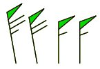

# **set barbopts**

This command controls the appearance of the pennant flags on wind barbs. It is available starting with GrADS version 2.1.1b0.

## Syntax

`set barbopts `*`opts`*

- `outline`     do *not* fill in the pennant\
  `filled`       fill in the pennant

### Usage Notes

If you are using a transparent color to draw filled barbs, you may notice a faint outline around the pennant flags; you can avoid this using <a href="colorcontrol.html#transparent">color masking</a>.

### Examples

Results that look like the image below may be accomplished by drawing filled barbs underneath outlined barbs.\
\
