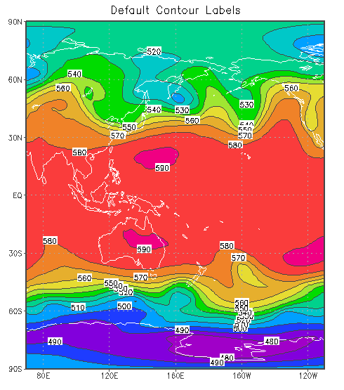
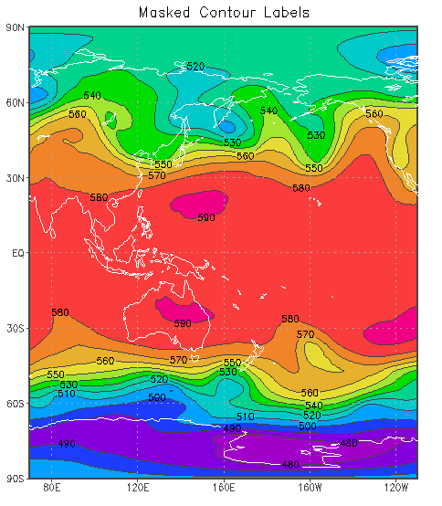

# **set clab**

`set clab `*`option`*

Controls contour labeling. The *`option`*argument may be one of the following:

- `on       `'fast' contour labels are plotted where the contour lines are horizontal\
  `off      `no contour labels\
  `forced   `an attempt is made to label all contour lines\
  *`format`*`   `gives a C-language template for conversion of the contour value to a string\
  `masked   `(version 2.0.a6+) contour lines have gaps for the labels, so rectangles for label background are not drawn; contour labels never overlap.\

## Usage Notes

1.  Changes to the contour labels are reset by clear, but not display.
2.  When `'set clab masked'` is used, the contour lines are masked out wherever the labels are drawn. The mask creates small gaps in the contour lines, so the labels can be read clearly without the small rectangles that are usually drawn behind the contour label. The mask also ensures that labels do not overlap. If additional contour plots are overlaid, the new labels do not interfere with labels already drawn. The end result is a less cluttered graphic that is much more legible.
3.  When `'set clab masked'` is used, you can defer drawing the map until after all the labeled contours have been drawn, and then the label mask will also create gaps in the map outine for ultimate contour label legibility.
4.  The `'clear mask'` command resets the contour label mask.

### Examples

1.  This command would cause all contour labels to have 2 digits after the decimal point:\
    `   set clab %.2f`\
    \
2.  For contouring temperatures, this command would add a degree symbol and the letter "C":\
    ``    set clab %.0f`3.`1C  ``\
    \
3.  Here are two graphics that illustrate the effect of using `'set clab masked'` in a display containing shaded contours and an overlay of labeled line contours. The default behavior is shown on the left; masked contour labels are shown on the right. The script fragments used to draw the plots are also provided below the images. Observe that contour lines and coastal boundaries are not drawn underneath the masked labels, so the white rectangles are not needed as a background. In addition, the masked labels do not overlap, making all of them legible.\

<table width="700" data-border="0">
<colgroup>
<col style="width: 50%" />
<col style="width: 50%" />
</colgroup>
<tbody>
<tr>
<td></td>
<td></td>
</tr>
<tr>
<td data-valign="top">
<code>cl='480 490 500 510 520 530 540 550 560 570 580 590 600 610'</code> 
<code>cc='   9  14   4  11   5  13   3  10   7  12   8   2   6'</code> 
<code>'set rgb 16 70 70 70'</code> 
<code>'set annot 16'</code> 
<code>'set map 0'</code> 
<code>* draw shaded contours</code> 
<code>'set gxout shaded'</code> 
<code>'set clevs 'cl</code> 
<code>'set ccols 'cc</code> 
<code>'set xlint 40'</code> 
<code>'d z(lev=500)/10'</code> 
<code>* draw labeled contours</code> 
<code>'set gxout contour'</code> 
<code>'set ccolor 16'</code> 
<code>'set clevs 'cl</code> 
<code>'set clopts 1'</code> 
<code>'d z(lev=500)/10'</code> 

</td>
<td>
<code>cl='480 490 500 510 520 530 540 550 560 570 580 590 600 610'</code> 
<code>cc='   9  14   4  11   5  13   3  10   7  12   8   2   6'</code> 
<code>'set rgb 16 70 70 70'</code> 
<code>'set annot 16'</code> 
<code>'set map 0'</code> 
<code>* turn off map</code> 
<code>'set mpdraw off'</code> 
<code>* draw shaded contours</code> 
<code>'set gxout shaded'</code> 
<code>'set clevs 'cl</code> 
<code>'set ccols 'cc</code> 
<code>'set xlint 40'</code> 
<code>'d z(lev=500)/10'</code> 
<code>* draw labeled contours</code> 
<code>'set gxout contour'</code> 
<code>'set ccolor 16'</code> 
<code>'set clevs 'cl</code> 
<code>'set clopts 1'</code> 
<code>'set clab masked'</code> 
<code>'d z(lev=500)/10'</code> 
<code>* draw the map</code> 
<code>'set mpdraw on'</code> 
<code>'draw map'</code>
</td>
</tr>
</tbody>
</table>
