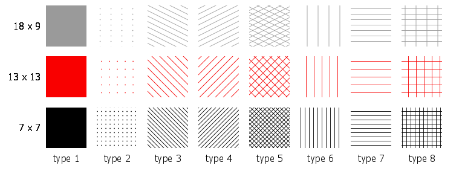
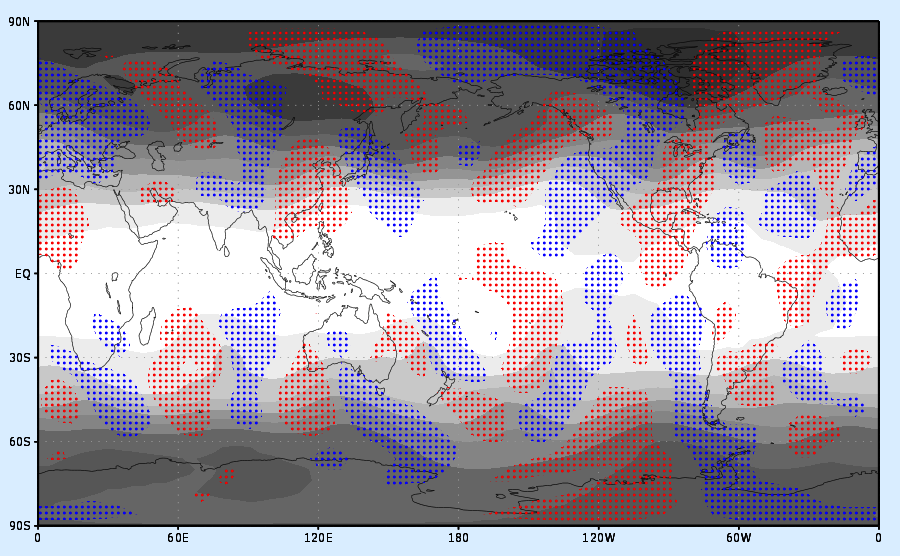

# **set tile**

This command, which is available beginning with GrADS version 2.1, is used to create a new pattern fill. Patterns are defined in the form of "tiles" which are small images that are used repeatedly to fill an area. GrADS supports the automatic generation of tiles for drawing certain simple patterns. More complex patterns can be acheived by providing a custom image file.

## Syntax

`set tile `*`number type <width <height <lwid <fgcolor <bgcolor>>>>>`*` `   (for automatic generation of basic tile patters)\
... or ...\
` set tile `*`number`*` 0 `*`filename                                     `*`   `(for user-supplied file containing the custom tile image)

where:

- *`number`*`    `is the tile number; it can range from 0 to 2047.\
  *`type`*`      `is the tile type, valid values and what they mean are shown below.\
  *`width`*`     `is the width of the generated tile in pixels (default is 9).\
  *`height`*`    `is the height of the generated tile in pixels (default is 9).\
  *`lwid`*`      `is the line thickness used to draw the lines in the tile. *`lwid`* must be an integer between 1 and 12 (default is 3).\
  *`fgcolor`*`   `is the color used to draw the lines or dots in the tile (default is opaque white).\
  *`bgcolor`*`   `is the color used to fill the background of the tile (default is fully transparent).\
  *`filename`*    the full name of the .png file (including the path) to be used as a custom tile for creating the patern.

Valid options for the tile *`type`* are as follows:

- ` 0 - `tile image is provided with specified *`filename`*\
  ` 1 - `solid\
  ` 2 - `dots\
  ` 3 - `diagonal downward lines\
  ` 4 - `diagonal upward lines\
  ` 5 - `diagonal cross hatching\
  ` 6 - `vertical lines\
  ` 7 - `horizontal lines\
  ` 8 - `rectangular cross hatching\

Once you have defined a new tile, create the pattern fill by assigning the defined tile number to a color using the <a href="gradcomdsetrgb.html">`set rgb`</a> command. The special syntax is:

`set rgb `*`nn`*` tile `*`tt`*

where:

*`nn`*` `is the color number (must be between 16 and 2047)\
*`tt`*` `is the defined tile number\

### Usage Notes

For the automatically generated tiles, GrADS creates a small image on the fly using the specified width and height. This tile image is filled with the foreground color (if the *`type`* is 1), or it is filled with the background color and then the dots or lines are drawn on top using the foreground color and the specified line thickness. Note that the lines are drawn from corner to corner (for diagonal lines) or through the middle of the image (for dots and horizontal or vertical lines). Thus the size of the image, as controlled by the width and height settings, will determine the spacing of the dots or lines in the pattern, and the aspect ratio of the image will control the angle of the lines. A smaller image will result in more closely spaced lines in the pattern, and a larger image will result in a more widely spaced pattern.

The fully described pattern fill will be a combination of the "set tile" command and "set rgb" commands. You may use the 16 pre-defined colors in the tiles or any newly defined color. The only restriction is that a color number that has a tile assigned to it may not be used as a foreground or background color for another tile. New colors and tiles may be defined in any order, but they should be set before any drawing is done. Changing color or tile values mid-stream in a plot may result in inconsistent behavior.

 

### Examples

The table of small images below shows what some basic automatically generated tiles can look like. Each colum has a different *`type`* number, from 1-8. Each row has a different foreground color and different values for the *`width`* and *`height`*, which are written to the left of each row. The value for *`lwid`* is 1 for all tiles.

This image illustrates how you can use a stippled pattern fill as an overlay on a shaded plot. Script sample to generate the plot is provided below.

 ` `

\* set up a grey scale color sequence with 'set rbcols'\
i = 60\
n = 60\
cmd = 'set rbcols'\
while (i\<256)\
  'set rgb 'n' 'i' 'i' 'i\
  cmd = cmd%' '%n\
  i = i + 15\
  n = n + 1\
endwhile\
cmd

\* define 2 colors\
'set rgb 20 255 0 0'\
'set rgb 21 0 0 255'

\* define 2 patterns\
'set tile 0 2 6 6 3 20'\
'set tile 1 2 6 6 3 21'\
'set rgb 22 tile 0'\
'set rgb 23 tile 1'

\* draw the height field with the gray shades\
'set gxout shaded'\
'set lev 200'\
'd z'

\* overlay stippled red/blue shading of v greater than 5 and less than -5\
'set clevs 5'\
'set ccols -1 22'\
'd v'\
'set clevs -5'\
'set ccols 23 -1'\
'd v'
