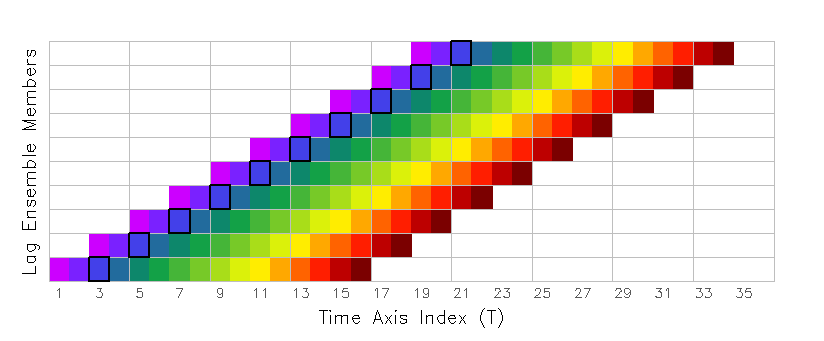
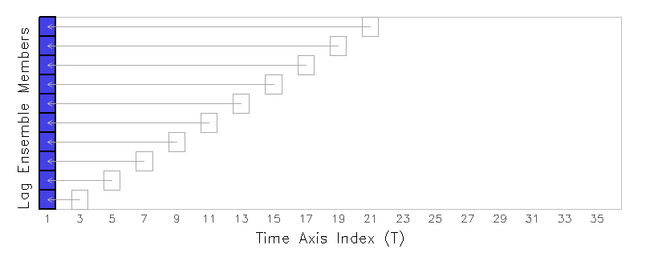
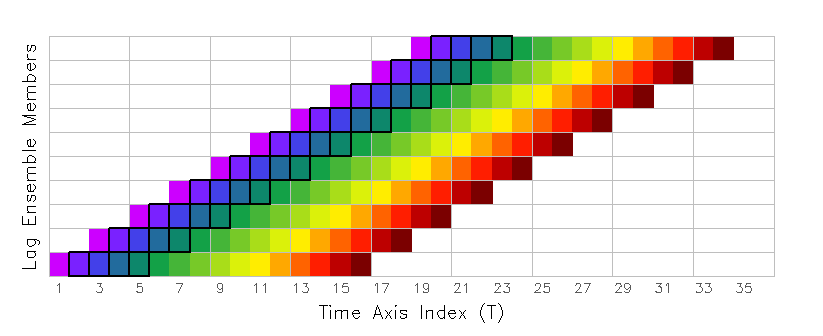
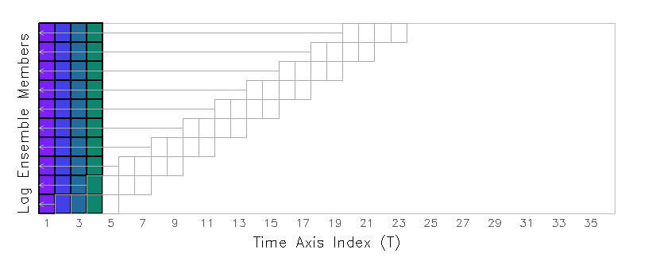

# Expression Evaluation Using the `offt` Dimension Override

## Contents

- [Motivation](#motivation)
- [Syntax](#syntax)
- [A diagonal slice](#tfixed)
- [A time-varying diagonal slice](#tvarying)
- [Applying a function over a time-varying diagonal slice](#applying-a-function-over-a-time-varying-diagonal-slice)

## Motivation

The GrADS time axis is a simple linear, one-dimensional object defined by its
start time, increment, and length. The ensemble axis is also linear, but it can
become more complicated when individual ensemble members have different start
times or lengths. In that situation, “initial time” can mean either the first
step in the defined time axis or the first step for a particular ensemble
member.

(syntax)=
## Syntax

Beginning with version 2.0.a7, GrADS has an expression syntax that distinguishes
absolute time-axis indices from offsets relative to an ensemble member’s
initial time. It is part of a [complete variable declaration](variable.md):

```text
abbrev.file#(dimexpr, dimexpr, ...)
```

| Component | Meaning |
| --- | --- |
| `abbrev` | Variable abbreviation from the data descriptor file |
| `file#` | File number containing the variable; omitted means the default file |
| `dimexpr` | Dimension expression that locally modifies the current environment |

An offset expression consists of `offt` followed by `=`, `+`, or `-` and an
offset value. For example, `p(offt=2)` selects the third valid time step from
each ensemble member.

The `offt` override is supported only for variables associated with a data
file. It does not work with defined variables or with dimension expressions
passed as arguments to functions such as [`ave`](gradfuncave.md) and
[`sum`](gradfuncsum.md).

(tfixed)=
## A diagonal slice

The examples use a lag ensemble data set with ten members. Each member is a
96-hour forecast with output every six hours, and members are initialized at
12-hour intervals. The figure illustrates the coverage of all members in the
time–ensemble domain; each colored box represents one forecast time step.



To extract the 12-hour forecast from every member (the third step from each
member’s initial time), first fix time and let ensemble vary:

```text
set t 1
set e 1 10
```

The third step is offset two steps from the initial time, so display the
variable with `offt=2`:

```text
display p(offt=2)
```

GrADS obtains each member’s initial time from the `EDEF` entry in the
descriptor file, retrieves the requested value, and aligns the results into a
grid with fixed time and varying ensemble dimensions.



The original valid time of each value is not retained. The result uses the
current time in the dimension environment (`t=1` in this example).

(tvarying)=
## A time-varying diagonal slice

To extract the first 24 hours of every member, request four time steps while
keeping all ten ensemble members varying:

```text
set t 1 4
set e 1 10
```

Use [`tloop`](gradfunctloop.md) with an `offt` expression:

```text
display tloop(p(offt+0))
```

At each fixed time, `tloop` evaluates the expression and then reconstructs a
time-varying result. Here `offt+0` is relative to the current time index: at
`t=1` it selects offset 1, at `t=2` offset 2, and so on.





Using `offt=0` would assign one fixed offset for every time step. For a
time-varying diagonal slice, use a relative expression (`+value` or `-value`),
not an assignment (`=value`).

(func)=
## Applying a function over a time-varying diagonal slice

To accumulate precipitation over the first 24 hours, one approach is to create
a defined variable with [`tloop`](gradfunctloop.md), then apply [`sum`](gradfuncsum.md):

```text
set t 1 4
set e 1 10
define pnew = tloop(p(offt+0))
set t 1
display sum(pnew, t=1, t=4)
```

More economically, let `sum` perform the time loop itself:

```text
set t 1
set e 1 10
display sum(p(offt+0), t=1, t=4)
```

Remember that `offt` applies only to variables associated with a data file. A
defined variable or a function argument cannot use it. For example, this is
invalid:

```text
display sum(p, offt=1, offt=4)
```
