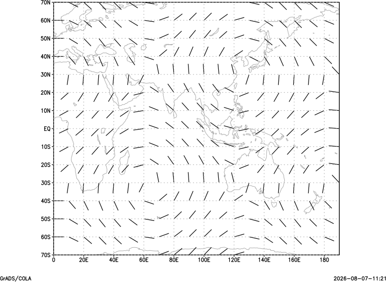

# Wind-barb plots

Wind barbs from paired U and V fields. This minimal example uses the shared deterministic plotting fixture.

## Example

```text
open test_plot_fixture.ctl
set x 1 20
set y 1 15
set gxout barb
display u;v
printim barb.png png white
```

## Relevant controls

Use [`set arrscl`](gradcomdsetarrscl.md), [`set barbopts`](gradcomdsetbarbopts.md), [`set ccolor`](gradcomdsetccolor.md), and [`set cthick`](gradcomdsetcthick.md) to control barb length, flags, color, and line width.



Download the [example script](_downloads/grads-scripts/test_plot.gs), the [descriptor](_downloads/grads-plot-fixtures/test_plot_fixture.ctl), and the [binary fixture](_downloads/grads-plot-fixtures/test_plot_fixture.bin).
