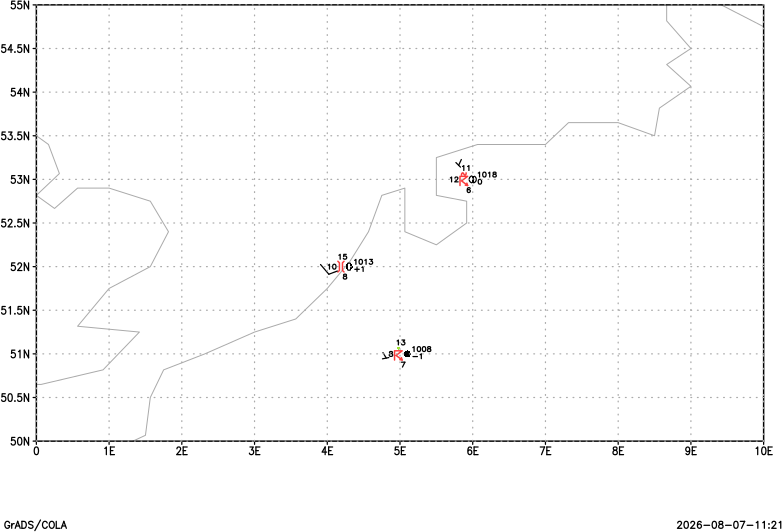

# Station models

A complete station model display. This minimal example uses the shared deterministic plotting fixture.

## Example

```text
open test_station_fixture.ctl
set gxout model
display u;v;t;d;slp;delta;cld;wx;vis
printim model.png png white
```

## Relevant controls

Use [`set wxopt`](gradcomdsetwxopt.md), [`set stid`](gradcomdsetstid.md), [`set ccolor`](gradcomdsetccolor.md), and [`set digsiz`](gradcomdsetdigsiz.md) to control weather symbols, station IDs, colors, and model size.



Download the [example script](_downloads/grads-scripts/test_plot.gs), [station descriptor](_downloads/grads-plot-fixtures/test_station_fixture.ctl), [station data](_downloads/grads-plot-fixtures/test_station_fixture.dat), and [station map](_downloads/grads-plot-fixtures/test_station_fixture.map).
