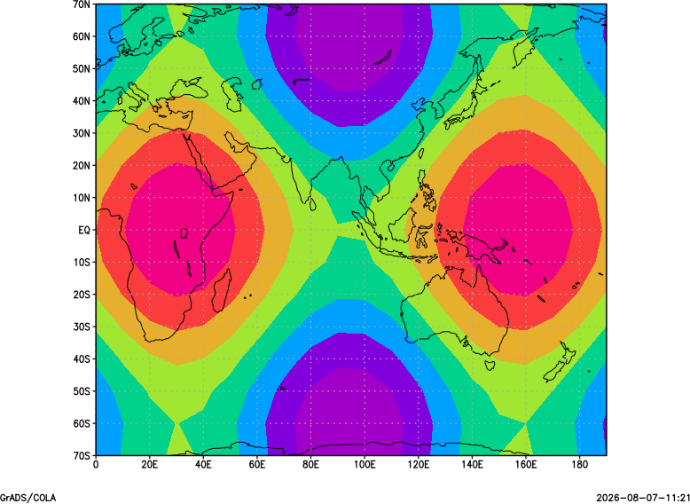

# Shaded contours

Filled contours using the shaded output mode. This minimal example uses the shared deterministic plotting fixture.

## Example

```text
open test_plot_fixture.ctl
set x 1 20
set y 1 15
set gxout shaded
display field
printim shaded.png png white
```

## Relevant controls

Use [`set clevs`](gradcomdsetclevs.md), [`set ccols`](gradcomdsetccols.md), [`set rbcols`](gradcomdsetrbcols.md), `set gxout shade2` or `shade2b`, [`set missconn`](gradcomdsetmissconn.md), and [`set black`](gradcomdsetblack.md) to control shading.



Download the [example script](_downloads/grads-scripts/test_plot.gs), the [descriptor](_downloads/grads-plot-fixtures/test_plot_fixture.ctl), and the [binary fixture](_downloads/grads-plot-fixtures/test_plot_fixture.bin).
