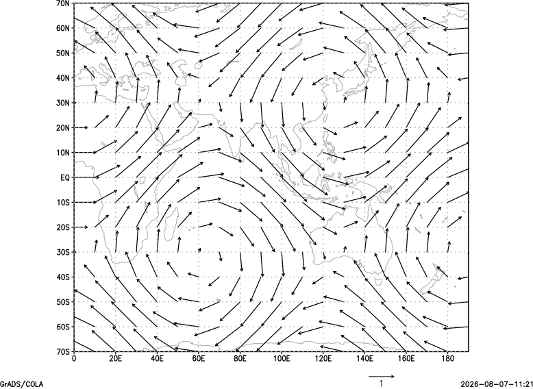

# Vector plots

Arrows from paired U and V fields. This minimal example uses the shared deterministic plotting fixture.

## Example

```text
open test_plot_fixture.ctl
set x 1 20
set y 1 15
set gxout vector
display u;v
printim vector.png png white
```

## Relevant controls

Use [`set arrscl`](gradcomdsetarrscl.md), [`set arrlab`](gradcomdsetarrlab.md), [`set arrowhead`](gradcomdsetarrowhead.md), [`set ccolor`](gradcomdsetccolor.md), and [`set cthick`](gradcomdsetcthick.md) to control vector scaling, labels, arrowheads, color, and width.



Download the [example script](_downloads/grads-scripts/test_plot.gs), the [descriptor](_downloads/grads-plot-fixtures/test_plot_fixture.ctl), and the [binary fixture](_downloads/grads-plot-fixtures/test_plot_fixture.bin).
