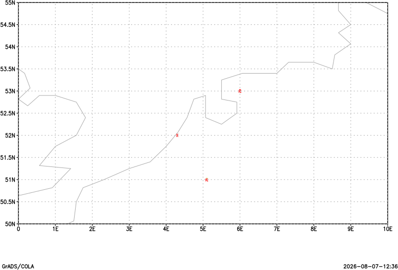

# Station weather symbols

Weather symbols at station locations. This minimal example uses the shared deterministic plotting fixture.

## Example

```text
open test_station_fixture.ctl
set gxout wxsym
display wx
printim wxsym.png png white
```

## Relevant controls

Use [`set wxopt`](gradcomdsetwxopt.md), [`set ccolor`](gradcomdsetccolor.md), [`set digsiz`](gradcomdsetdigsiz.md), and [`set stid`](gradcomdsetstid.md) to control symbol type, color, size, and station labels.



Download the [example script](_downloads/grads-scripts/test_plot.gs), [station descriptor](_downloads/grads-plot-fixtures/test_station_fixture.ctl), [station data](_downloads/grads-plot-fixtures/test_station_fixture.dat), and [station map](_downloads/grads-plot-fixtures/test_station_fixture.map).
