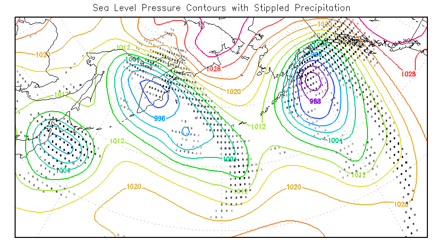
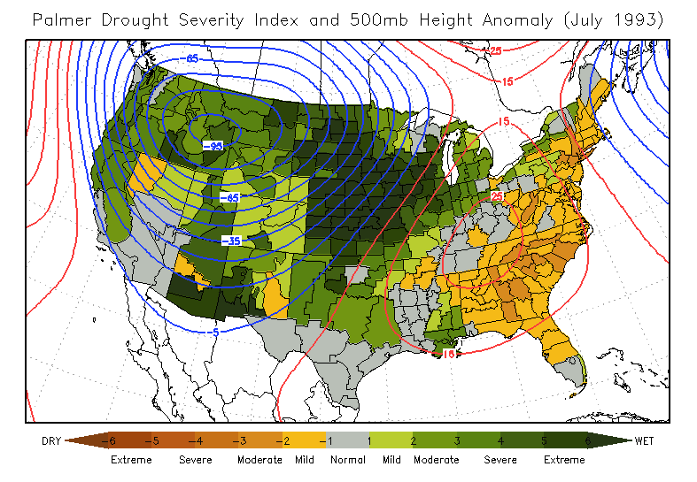
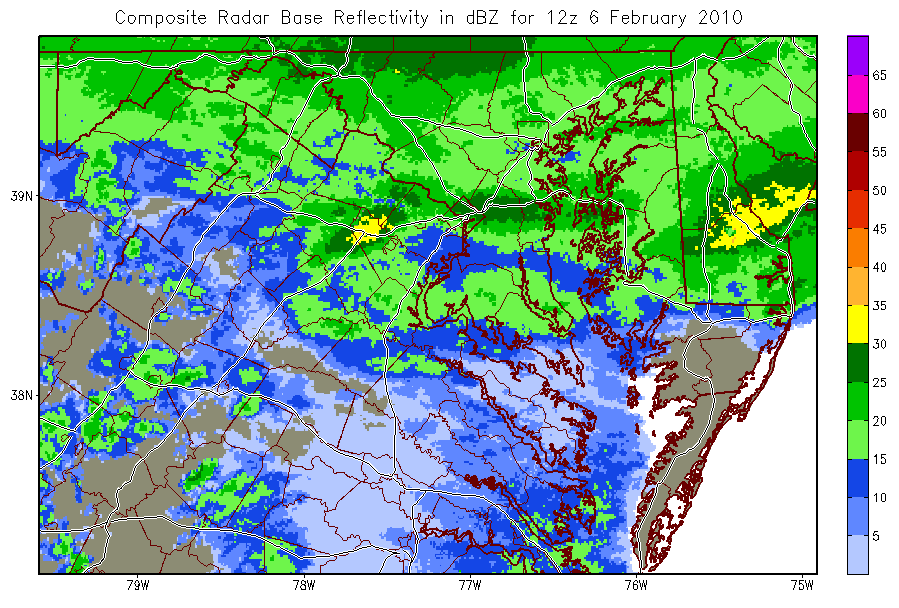

# The Shapefile Interface in GrADS

GrADS can draw and query existing ESRI Shapefiles and can create new
shapefiles from gridded or station data. This page describes the file format,
the drawing and query commands, file lookup, polygon behavior, and shapefile
creation.

(shapefile-intro)=
## Introduction

Shapefile support was introduced in GrADS 2.0.a8 for drawing and querying
data. GrADS 2.0.a9 added support for creating point and line shapefiles from
GrADS data sets.

(shapefile-whatis)=
## What is a shapefile?

The shapefile format stores non-topological geometry and attribute data for
spatial features. A feature can be a point, line, or polygon. Common uses
include coastlines, political boundaries, administrative regions, roads,
rivers, and climate zones.

An ESRI shapefile is a group of files with the same filename root:

| Component | Purpose | Required |
|---|---|---|
| `.shp` | Geometry and vertices | Yes |
| `.shx` | Index of geometry records | Yes |
| `.dbf` | Attribute records | Needed for attributes and `q dbf` |
| `.prj` | Coordinate-system metadata | Optional; not used by GrADS for reprojection |

Some sources of freely available shapefiles include:

- [National Weather Service Shapefile Database](https://www.weather.gov/gis/AWIPSShapefiles)
- [Natural Earth](https://www.naturalearthdata.com/downloads/)

(shapefile-draw)=
## Drawing shapefiles

Use [`draw shp`](gradcomddrawshp.md) to draw a shapefile as an overlay on an
existing plot. Draw a variable first so GrADS can establish the display
dimensions and scaling. The plot must vary in the X-Y (longitude/latitude)
domain.

```text
display temperature
draw shp ne10m_land
```

The filename extension is optional. GrADS supports three graphical element
types:

- **Points** are drawn with the mark type and size from
  [`set shpopts`](gradcomdsetshpopts.md); their color comes from
  [`set line`](gradcomdsetline.md).
- **Lines** use the color, style, and thickness configured by
  [`set line`](gradcomdsetline.md).
- **Polygons** are outlined by default. Use
  [`set shpopts`](gradcomdsetshpopts.md) to enable filling and select the
  fill color.

By default, `draw shp` draws every feature. Supply one feature number or a
feature range to draw only part of a file:

```text
draw shp boundaries 12
draw shp boundaries 12 20
```

Use [`q shpopts`](gradcomdqshpopts.md) to inspect the current shapefile
drawing settings.

### Natural Earth masks included with GrADS

Conda installations include Natural Earth land and ocean masks at 110m, 50m,
and 10m resolution. They are available through `GADDIR` and can be used by
the packaged [`nebasemap.gs`](basemap.md) script:

```text
set mpdset ne10m
display temperature
nebasemap O 20 0 10m
```

See [Basemap Script](basemap.md) and [Natural Earth Map Data
Sets](naturalearthmaps.md) for the recommended mask workflow.

(shapefile-query)=
## Querying shapefiles

[`q shp`](gradcomdqshp.md) reports the shapefile type, feature count,
longitude/latitude bounds, vertex counts, and the number of parts in each
feature. [`q dbf`](gradcomdqdbf.md) reports the attribute field names and
values.

```text
q shp ne10m_land
q dbf ne10m_land
```

The Z and M values reported by `q shp` are not used for drawing; GrADS uses
the X and Y coordinates as longitude and latitude positions.

(shapefile-envv)=
## Finding shapefiles

### Conda installations and `GADDIR`

When the conda-forge environment is activated, its activation hook sets
`GADDIR` to the environment's `share/grads` directory. That directory
contains the packaged Natural Earth shapefiles, `nebasemap.gs`, map data,
fonts, and the default graphics plug-in table. The hook restores the previous
`GADDIR` value when the environment is deactivated.

In a conda environment, do not replace this `GADDIR` value with a path from a
different GrADS installation. Doing so can make GrADS load incompatible data
files or plug-ins.

### `GASHP` search path and precedence

`GASHP` is an optional user-defined list of directories containing shapefiles.
Multiple directories may be separated by spaces, commas, semicolons, or
colons.

For a relative shapefile name such as `ne10m_land`, GrADS searches in this
order:

1. The name exactly as supplied, relative to the current directory.
2. Each directory listed in `GASHP`, from left to right.
3. The directory named by `GADDIR`.

The conda activation hook does **not** set or overwrite `GASHP`. An existing
user value therefore remains active while the conda environment is active and
is unchanged when that environment is deactivated. This is intentional: a
user's own shapefile directory can override a packaged file with the same
filename root.

For example, if `GASHP` contains an older `ne10m_land.shp`, that file is used
before the packaged `$CONDA_PREFIX/share/grads/ne10m_land.shp`. To force the
packaged file, either remove the conflicting directory from `GASHP` for the
current shell or use its full path:

```bash
unset GASHP
```

```text
draw shp /path/to/conda/env/share/grads/ne10m_land
```

The same lookup order is used for the `.shp` and `.dbf` handles needed by
`draw shp`, `q shp`, and `q dbf`. GrADS does not use `.prj` information to
reproject the geometry; prepare shapefiles in the coordinate system expected
by the plot.

If a stale `GASHP` entry does not contain the requested file, the underlying
Shapelib probe may print an unsuccessful path before GrADS continues to the
next directory and eventually finds the file in `GADDIR`. This message does
not indicate a failure when the later lookup succeeds; remove obsolete
directories from `GASHP` if you want to avoid the extra diagnostic.

The packaged `nebasemap.gs` script is also found through `GADDIR` when it is
not present in a user-configured `GASCRP` directory. A user script with the
same name in `GASCRP` takes precedence.

## Writing shapefiles

GrADS can write point and line shapefiles from gridded or station data. Set
`gxout` to `shp`, configure the output with [`set shp`](gradcomdsetshp.md),
and add optional attributes with `set shpattr`.

```text
set gxout shp
set shp -pt -fmt 8 4 gridptm
set shpattr AUTHOR string JMA
set shpattr TYPE string grid points
set shpattr DESC string land surface temperature
display maskout(tsfc,landmask-1)

set gxout shp
clear shp
set shp -ln -fmt 8 4 linem
set shpattr AUTHOR string JMA
set shpattr TYPE string grid contours
set shpattr DESC string surface temperature
display tsfc
```

Point shapes can be created from station data or grid-point values. Line
shapes are created from the contouring of a grid expression. GrADS writes
automatically generated metadata, including the GrADS version and geographic
coordinates, and can add static attributes with `set shpattr`.

Use [`q shpopts`](gradcomdqshpopts.md) to inspect shapefile output settings.
[`clear shp`](gradcomdclear.md), `reset`, and `reinit` release user-defined
shapefile attributes; use `clear shp` when the other GrADS settings should be
preserved.

(shapefile-caveat)=
## Polygon rings and holes

A polygon feature may contain multiple rings. Exterior rings define filled
regions and interior rings define holes. When filled polygons are drawn,
GrADS now keeps all rings belonging to one feature in a compound path and
uses the even-odd fill rule. Islands, lakes, and other nested geometry are
therefore rendered with the expected holes.

The number of parts in a feature is shown by `q shp`. A shapefile can still
contain malformed or self-intersecting geometry, so externally sourced data
should be validated or repaired with a GIS tool before it is used.

(example4)=
## Examples and further reading

The repository contains examples of creating and drawing measured point and
line shapefiles. The current documentation and downloadable script library
are available from the [GrADS documentation site](https://wetterzentrale.de/grads/doc/gadoc.html).

The following figures show shapefile overlays produced by the example
workflows:






